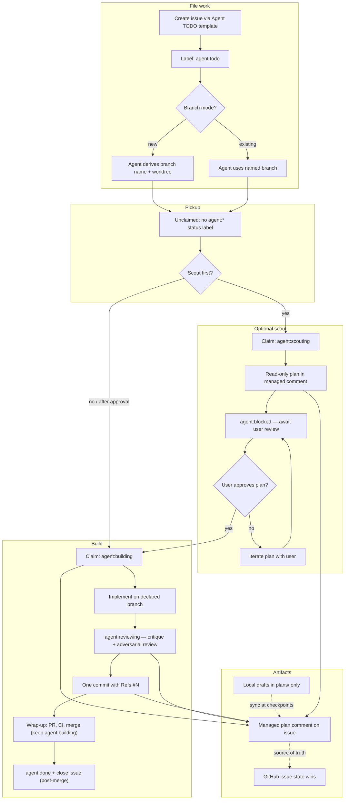
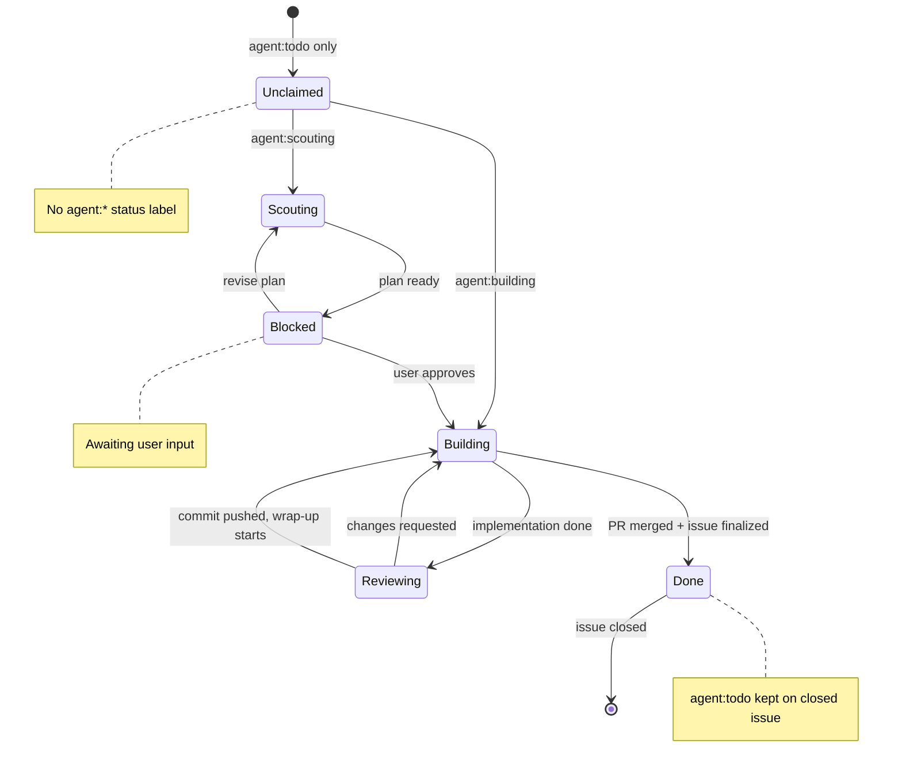
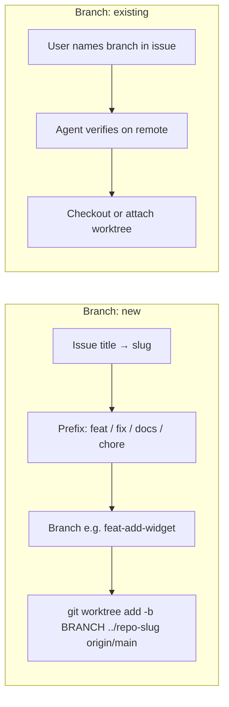

# Contributing

This repository coordinates work through **GitHub Issues**, not ad-hoc chat or local todo lists. Agent-actionable items use the `agent:todo` label and a structured lifecycle.

- **Humans** file work with the [Agent TODO](.github/ISSUE_TEMPLATE/agent-todo.yml) issue template and review plans before build.
- **Agents** follow [AGENTS.md](AGENTS.md) (rules) and [`.skills/github-issue-workflow/SKILL.md`](.skills/github-issue-workflow/SKILL.md) (`gh` mechanics).

## Filing an agent TODO

1. Open **Issues → New issue → Agent TODO**.
2. Fill in **Task** (what, constraints, acceptance criteria).
3. Choose **Branch**:
   - **`new`** — agent creates a conventional branch (e.g. `feat-my-slug`) from the default branch and works in a separate **worktree**.
   - **`existing`** — name the branch (e.g. `feat-agentic-research-workflow`); agent continues work there.
4. Submit. The issue is auto-labeled `agent:todo`.

Issues without `agent:todo` (bugs, discussions, feature ideas) are **not** part of this workflow unless relabeled.

## Workflow overview



## Status labels

Type label **`agent:todo`** persists for the issue's lifetime. **Status labels are mutually exclusive** — at most one at a time.



| Label | Meaning |
| ----- | ------- |
| *(none)* | Unclaimed — ready for pickup |
| `agent:scouting` | Scout drafting plan (read-only outside plan comment) |
| `agent:blocked` | Paused — typically awaiting plan approval |
| `agent:building` | Builder implementing (one build per agent session) |
| `agent:reviewing` | Done coding; critique and security review before commit |
| `agent:done` | PR merged; issue finalized and closed (or already closed) |

## Branch and worktree



When **Branch** is `existing`, the **Existing branch name** field is required — agents stop and ask if it is missing.

## Managed plan comment

Each agent TODO has **exactly one** plan comment on the issue, marked with `<!-- agent-plan:start -->` … `<!-- agent-plan:end -->`. It must be updated at:

1. End of scouting (plan ready for review)
2. Start of build (plan confirmed)
3. End of build, before commit (what changed, what was verified)
4. After commit (final status + commit hash)
5. After merge, before close (final status + merge commit hash)

Local files under `plans/` are drafts only; **the issue comment is the source of truth**.

## Rules of the road

| Rule | Summary |
| ---- | ------- |
| Claim before reading | Set an `agent:*` status label before substantive work on an issue |
| One build at a time | At most one `agent:building` issue per agent session |
| Don't steal claims | If another agent is scouting or building, stop and coordinate |
| One issue = one commit | Conventional message; `Refs #<num>` in the footer |
| GitHub state wins | If local drafts disagree with the issue, the issue is correct |
| No secrets in issues | Never paste tokens, `.env` contents, credentials, or PII |

## Scouting vs building

**Scouting** (optional, parallel-safe):

- Triggered when you want a read-only plan before implementation.
- Scout claims `agent:scouting`, writes only to the managed comment (and `plans/scouting-<slug>.md` locally).
- Does **not** edit code, docs, or tests.
- Sets `agent:blocked` when the plan is ready for your review.

**Building**:

- Starts only after explicit plan approval (or when scouting was skipped).
- Builder claims `agent:building`, implements, runs critique + adversarial review, commits, wraps up through PR merge, then finalizes close-out.

If you pick up a **scouted** issue, start from the managed plan comment and **do not** jump straight to implementation — confirm the plan with the user first.

## For agents

Read [AGENTS.md](AGENTS.md) at session start. Use [`.skills/github-issue-workflow/SKILL.md`](.skills/github-issue-workflow/SKILL.md) for `gh` commands, label transitions, branch naming, worktree setup, and post-merge issue finalization.

**List open, unclaimed TODOs:**

```bash
gh issue list --state open --label "agent:todo" \
  --search "-label:agent:scouting -label:agent:building -label:agent:blocked -label:agent:reviewing"
```

## One-time repo setup

If `agent:*` labels do not exist yet:

```bash
gh label create "agent:todo"      --color 0e8a16 --description "Agent: TODO (agent-actionable)"
gh label create "agent:scouting"  --color a2eeef --description "Agent status: scouting (plan in progress)"
gh label create "agent:building"  --color fbca04 --description "Agent status: building (implementation in progress)"
gh label create "agent:blocked"   --color d73a4a --description "Agent status: blocked (awaiting user or external)"
gh label create "agent:reviewing" --color 0075ca --description "Agent status: reviewing (critique pending)"
gh label create "agent:done"      --color cfd3d7 --description "Agent status: done (merged and closed)"
```
