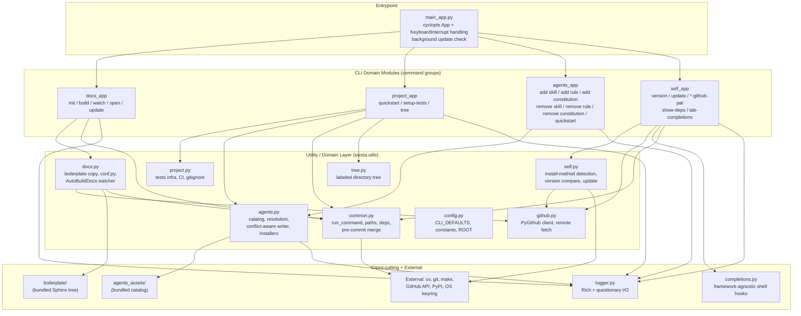
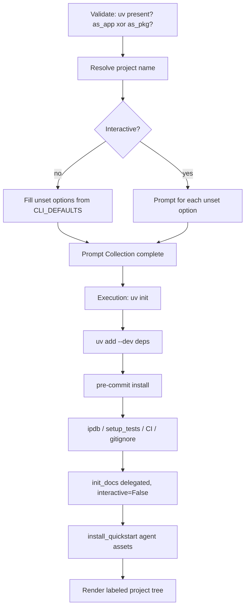

# Siesta Technical Architecture

## Overview

**Siesta** ("Siesta Is Entalpic'S Terminal Assistant") is a command-line tool that
scaffolds and maintains Entalpic's standard Python project conventions. It is a
**write-oriented CLI**: most commands exist to mutate a target project's filesystem —
initializing a `uv` project, wiring up pytest and GitHub Actions, generating a Sphinx
documentation tree, and installing "Agent Assets" (Skills, Rules, Constitutions) into
Cursor and Claude provider directories. A smaller set of read-oriented commands manage
the tool itself (version checks, self-update, shell tab-completions).

The system is distributed as a `uv tool` / `pipx` / `pip` installable package and run as
the `siesta` executable. It targets individual developers' machines, not servers: every
operation is local, interactive-by-default, and idempotent where practical. There is no
persistent state beyond an update-check cache and the OS keyring entry holding an optional
GitHub Personal Access Token.

The dominant design concern is **safe mutation of a user's working directory**. The
codebase encodes this through a strict command lifecycle (validate → collect decisions →
mutate), a conflict-aware file-writing layer (skip / overwrite / backup), and a security
policy that keeps secrets off the command line. These invariants — not any framework — are
what an engineer must understand to reason about the system.

## System Architecture



The architecture is a conventional **layered CLI**: a thin entrypoint wires four
independent **CLI Domain Modules**, each owning one command group, on top of a
**utility/domain layer** that holds the real logic. The split is deliberate — command
modules are responsible for *decision collection and orchestration*, while `siesta.utils.*`
modules are responsible for *execution* (filesystem writes, subprocess calls, network
I/O). This keeps the mutating primitives testable in isolation and makes the
command-lifecycle contract (below) enforceable at a single layer.

Two subsystems are intentionally decoupled from the rest. [completions.py](src/siesta/completions.py)
is written to be framework-agnostic (it never imports `cyclopts`; the completion generator
is injected as a callable), so it can be unit-tested and even retargeted to another CLI by
changing one constant. The bundled `agents_assets/` and `boilerplate/` directories are
**data, not code** — shipped inside the wheel and read at runtime via `importlib.resources`.

## Repository Layout

```
siesta/
├── pyproject.toml              # hatchling build; deps; entrypoint siesta = main_app:main
├── uv.lock                     # pinned environment (uv is the assumed toolchain)
├── README.md / CONTRIBUTING.md
├── AGENTS.md / CONTEXT.md      # this repo's own Constitution + domain glossary
├── system-architecture.md      # this document
│
├── src/siesta/                 # the package (src-layout)
│   ├── __init__.py             # exposes __version__
│   ├── logger.py               # Rich + questionary I/O surface
│   ├── completions.py          # framework-agnostic shell-completion engine
│   ├── dependencies.json        # recommended docs/dev dependency lists
│   ├── precommits.yaml          # reference pre-commit config (merged into targets)
│   │
│   ├── cli/                    # CLI Domain Modules (one per command group)
│   │   ├── main_app.py          # root cyclopts App + main() entrypoint
│   │   ├── _shared.py           # cross-command helpers (e.g. resolve_shell)
│   │   ├── agents_app.py / docs_app.py / project_app.py / self_app.py
│   │
│   ├── utils/                  # execution layer (writes, subprocess, network)
│   │   ├── agents.py            # asset catalog, resolution, conflict-aware writer
│   │   ├── docs.py / project.py # scaffolding generators
│   │   ├── self.py / github.py  # self-update + GitHub/PyPI access
│   │   ├── common.py / config.py / tree.py
│   │
│   ├── agents_assets/          # bundled Agent Asset Catalog (data, not code)
│   │   ├── skills/<name>/SKILL.md
│   │   ├── rules/<name>.mdc
│   │   ├── constitutions/<name>/{AGENTS.md, CLAUDE.md}
│   │   └── quickstart.yaml       # Quickstart Config (curated default subset)
│   │
│   └── boilerplate/            # bundled Sphinx project template (data, not code)
│       ├── Makefile / make.bat
│       └── source/{conf.py, index.rst, _static/, _templates/}
│
├── tests/                      # pytest suite mirroring the source layout
│   ├── conftest.py
│   ├── test_cli/                # one module per command group
│   ├── test_utils/              # agents / project / tree unit tests
│   └── test_logger.py, test_copyrights.py
│
├── docs/                       # the project's own rendered Sphinx docs
│   ├── source/{conf.py, guide/, ...}
│   └── adr/                     # Architecture Decision Records (see below)
│
└── .github/
    ├── workflows/test.yml       # CI: runs the pytest suite
    └── ISSUE_TEMPLATE/agent-todo.yml
```

Two structural conventions are worth internalizing. **`cli/` vs `utils/` is the
orchestration/execution split** described above — when tracing a command, start in
`cli/<group>_app.py` for the lifecycle and decision logic, then follow into the matching
`utils/` module for the actual mutations. **`agents_assets/` and `boilerplate/` are bundled
data**, included in the wheel/sdist via the `[tool.hatch.build]` config in `pyproject.toml`
and read at runtime through `importlib.resources` — never imported.

### Architecture Decision Records

Design rationale that predates this document lives in [docs/adr/](docs/adr/). These are the
authoritative source for *why* the core invariants exist and should be read alongside the
relevant sections here:

| ADR | Title | Relates to |
|-----|-------|------------|
| [0001](docs/adr/0001-prompt-first-command-execution.md) | Prompt-First Command Execution | The Command Lifecycle / Ordering Contract |
| [0002](docs/adr/0002-cli-package-modularization.md) | CLI Package Modularization | The `cli/` ↔ `utils/` layering |
| [0003](docs/adr/0003-secret-handling-policy.md) | Secret Handling Policy | PAT handling in `self_app` / `github` |
| [0004](docs/adr/0004-cross-provider-agent-assets.md) | Cross-Provider Agent Asset Installation | Providers, Asset Scope, Mirroring |
| [0005](docs/adr/0005-nested-agent-asset-operations.md) | Nested Agent Asset Operations | `agents add` / `agents remove` command shape |
| [0006](docs/adr/0006-conflict-resolution-in-prompt-collection-phase.md) | Conflict Resolution in Prompt Collection Phase | Ordering Contract / Conflict Resolution |
| [0007](docs/adr/0007-unified-conflict-resolution-seam.md) | Unified Conflict-Resolution Seam | `Mutation` Protocol, `Resolution` model, `--overwrite`/`--backup` |

## Core Concepts

### The Command Lifecycle (Ordering Contract)

The system's central invariant is that **every command runs three phases in order**:

1. **Validation Phase** — fail-fast, non-mutating checks (e.g. "is `uv` installed?",
   "does this path already exist?", "is the requested asset in the catalog?").
2. **Prompt Collection Phase** — *all* user decisions are gathered before any write.
3. **Execution Phase** — only the selected mutations are performed.

This **Ordering Contract** guarantees a user is never left with a half-mutated project
because a prompt appeared mid-write. It is visible as explicitly commented sections in the
command bodies — see [project_app.py](src/siesta/cli/project_app.py#L711-L838) where
`quickstart` collects every `confirm()` answer up front, then performs all `uv init`,
dependency, test, docs, and agent-asset writes afterward.

### Input Precedence & Decision Ownership

Decisions resolve in a fixed order: **explicit CLI flags win**, then non-interactive
**`CLI_DEFAULTS`** ([config.py](src/siesta/utils/config.py#L26)), then interactive prompts
for whatever remains unspecified. A `bool | None` flag signature is the mechanism: `None`
means "unspecified → may prompt", an explicit `True`/`False` short-circuits the prompt.

**Decision Ownership** complements this: the top-level invoked command owns prompt
collection and passes *explicit* decisions down to helpers. When `project quickstart`
delegates to `setup_tests(...)` and `init_docs(...)`, it calls them with
`interactive=False` and concrete values so the nested commands never re-prompt — see
[project_app.py:794](src/siesta/cli/project_app.py#L794) and
[project_app.py:818](src/siesta/cli/project_app.py#L818).

### Mutation & the Conflict-Aware Writer

A **Mutation** is any filesystem write or external side effect. All mutating commands share one seam in [conflicts.py](src/siesta/utils/conflicts.py): each operation implements `detect_conflicts() → list[Conflict]` (pure, Prompt Collection Phase) and `apply(resolutions) → OperationSummary` (Execution Phase). A driver, `run_mutations`, resolves every conflict via `resolve_conflict` (driven by `--overwrite` / `--backup` or an interactive prompt) before the first `apply()`.

**Resolution** is a five-outcome enum (`skip`, `overwrite`, `backup`, `abort`, `merge`); each `Conflict` exposes only the applicable subset. `merge` is the content-preserving prepend for an existing `CLAUDE.md`. Low-level writes go through `write_path`; outcomes accumulate in `OperationSummary` and render via `render_summary`.

### Providers, Asset Scope, and Mirroring

The agent-assets domain is defined by three orthogonal axes, every install resolving to a
**Provider × Asset Scope** destination:

- **Provider** — `cursor` or `claude`, resolved by `resolve_providers` (default: both).
- **Asset Scope** — `local` (`./.cursor`, `./.claude`) or `global` (`~/.cursor`,
  `~/.claude`), resolved by `resolve_scope`. `base_dir` computes the root.
- **Asset kind** — Skill (a directory), Rule (a single file), or Constitution
  (`AGENTS.md` + optional `CLAUDE.md` stub).

**Provider Mirroring** is the guarantee that an asset is equivalent across providers,
differing only in vendor-required format. The one real transform is
[`mdc_to_claude`](src/siesta/utils/agents.py#L217): a Cursor `.mdc` rule's `globs`/
`alwaysApply` frontmatter is translated to Claude's `paths` frontmatter, body copied
verbatim. Cursor receives the canonical `.mdc` unchanged.

## Data Models

This is a stateless CLI; "data models" are mostly small dicts and the bundled asset
catalog rather than persisted entities.

### Agent Asset Catalog (bundled, read-only)

The only install source is the directory tree shipped inside the package at
[src/siesta/agents_assets/](src/siesta/agents_assets/), accessed via
`importlib.resources.files("siesta")`:

```
agents_assets/
├── skills/<name>/SKILL.md (+ supporting files)   # Skill = directory
├── rules/<name>.mdc                              # Rule = canonical Cursor file
├── constitutions/<name>/AGENTS.md, CLAUDE.md     # Constitution = source + stub
└── quickstart.yaml                               # Quickstart Config (curation, not an asset)
```

The **Constitution** model is the subtlest: `AGENTS.md` is the **source of truth** and is
*always* written (Cursor compatibility, harmless for Claude); `CLAUDE.md` is merely an
`@AGENTS.md` import stub. When a `CLAUDE.md` already exists, the installer **prepends** the
import line rather than overwriting, preserving user content
([agents.py:672](src/siesta/utils/agents.py#L672)). On removal, `agents remove constitution`
must not delete `AGENTS.md` while leaving a `CLAUDE.md` that still imports it — the command
surfaces that cross-file dependency during Prompt Collection and suggests manual cleanup
rather than rewriting `CLAUDE.md` automatically.

### Install Summary

The common return value across installers — `dict[str, list[str]]` with keys `written`,
`skipped`, `backed_up`. Helpers merge per-asset summaries into one before
`print_summary`.

### Update-Check Cache

The only persisted state besides the keyring: a JSON file in the platform cache dir
(`platformdirs.user_cache_dir`) holding `{last_check, latest_version}`
([self.py:344](src/siesta/utils/self.py#L344)). It throttles background update checks to
once per `SIESTA_UPDATE_CHECK_HOURS` (default 24).

## Component Breakdown

### Entrypoint: `main_app`
**Location**: [src/siesta/cli/main_app.py](src/siesta/cli/main_app.py)
Builds the root `cyclopts.App`, registers the four sub-apps, and exposes `main()` (the
`siesta` console script). `main()` wraps `app()` to translate `KeyboardInterrupt` into a
clean **Cancellation** (exit 130 via `logger.abort`), and fires a non-blocking background
update check whose result is printed only on clean exit.

### `agents_app` + `utils/agents`
**Location**: [agents_app.py](src/siesta/cli/agents_app.py), [utils/agents.py](src/siesta/utils/agents.py)
The richest domain. Nested `add` and `remove` sub-apps expose per-kind commands
(`skill`, `rule`, `constitution`); `quickstart` stays at the `agents` level.
Add commands are thin: they resolve scope/providers/selection (Validation Phase)
then loop over installers (Execution Phase). Remove commands follow a stricter
validate → collect per-candidate confirmations → mutate flow: every detected
removal target is confirmed through questionary before any file is deleted or
rewritten. Constitution removal additionally checks whether deleting `AGENTS.md`
alone would leave `CLAUDE.md` with a broken `@AGENTS.md` import (including
local `--cursor` runs where both files coexist). All catalog discovery, installed-asset detection, path resolution,
``.mdc`` translation, the conflict-aware writer, conservative Constitution
removal, and the `quickstart.yaml` loader live in `utils/agents`.
`agents quickstart -i` collects category selections from the **Quickstart Config**
before Mutation; `install_quickstart` validates every selected name against the catalog
before any write, then reuses the per-asset installers.

### `project_app` + `utils/project`
**Location**: [project_app.py](src/siesta/cli/project_app.py), [utils/project.py](src/siesta/utils/project.py)
`quickstart` is the flagship command and the clearest example of the lifecycle and Decision
Ownership: it requires `uv`, resolves all of `precommit/docs/deps/ipdb/tests/actions/`
`gitignore/agents`, then orchestrates `uv init`, dependency installs, pre-commit, tests
(delegating to `setup_tests`), CI, gitignore, docs (delegating to `init_docs`), and agent
assets. `utils/project` writes the pytest scaffold, the GitHub Actions test workflow, and a
language-appropriate `.gitignore`.

### `docs_app` + `utils/docs`
**Location**: [docs_app.py](src/siesta/cli/docs_app.py), [utils/docs.py](src/siesta/utils/docs.py)
Manages a Sphinx project: `init` (copy boilerplate, install deps, template `conf.py`,
write RTD config), `build` (`make clean && make html`, `uv run`-aware), `watch`, `open`,
and `update`. `watch` uses a `watchdog` `RegexMatchingEventHandler` subclass,
`AutoBuildDocs`, to rebuild on source/`.rst` changes while ignoring AutoAPI-generated files
to avoid rebuild loops. Boilerplate is read from the bundled
[boilerplate/](src/siesta/boilerplate/) tree by default, or fetched from GitHub with
`--remote-assets`.

### `self_app` + `utils/self` + `completions`
**Location**: [self_app.py](src/siesta/cli/self_app.py), [utils/self.py](src/siesta/utils/self.py), [completions.py](src/siesta/completions.py)
Tool self-management. `utils/self` detects the **install method** by inspecting
`sys.executable` and `direct_url.json` (uv tool / pipx / pip / editable), picks the matching
upgrade command, and refuses to auto-update editable installs. Version source is chosen by
install origin: GitHub releases/tags for git installs, PyPI otherwise.

`completions` is a self-contained shell-completion engine. Its key design move is the
**static-cache hook**: at shell startup a generated hook sources a cached completion script
*without spawning Python*; only on the first CLI use after an upgrade (detected by comparing
executable mtime to the cache file) does it regenerate the script. Multiple installs are
isolated by `exec_id` (SHA-256 of the executable path).

### Cross-cutting: `logger`, `utils/common`, `utils/config`, `utils/github`
- [logger.py](src/siesta/logger.py) — the single I/O surface. A `Logger` wraps Rich for
  styled/panelled output and **questionary** for prompts (`confirm`, `checkbox`, `select`,
  `prompt`). Prompts return `None` on Ctrl-C, which the logger converts to
  `KeyboardInterrupt` so the entrypoint can handle Cancellation uniformly. `confirm_secret`
  is fail-closed (declines on non-tty/EOF).
- [utils/common.py](src/siesta/utils/common.py) — shared primitives: `run_command`
  (the subprocess boundary), `resolve_path`, dependency loading from `dependencies.json`,
  project-name detection, and idempotent pre-commit config merging.
- [utils/config.py](src/siesta/utils/config.py) — constants, `CLI_DEFAULTS`, and `ROOT`
  (the package resource root).
- [utils/github.py](src/siesta/utils/github.py) — PyGithub client (PAT from keyring,
  unauthenticated fallback), recursive remote-content fetch, and error normalization.

## Key Workflows

### `siesta project quickstart` (greenfield project)



The flow embodies the Ordering Contract end-to-end: nothing under "Execution" runs until
every decision above it is fixed, and delegated sub-commands receive explicit values.

### Agent-asset install (conflict resolution)

For each `(provider, scope)` destination, `write_file`/`write_dir` call `_decide_action`.
Non-interactive + existing target → **skip**; `--force` → overwrite (or `backup_write`
with `--backup`); `-i` → prompt skip/overwrite/backup. Constitutions special-case an
existing `CLAUDE.md` by prepending `@AGENTS.md` instead of clobbering.

## Technical Stack

- **CLI framework**: `cyclopts` — type-hint-driven command/argument binding; `bool | None`
  flags drive Input Precedence.
- **Terminal I/O**: `rich` (output, panels, spinners) + `questionary` (interactive prompts).
- **YAML / config**: `ruamel.yaml` (round-trip pre-commit merge, safe loads), JSON for
  `dependencies.json` and the update cache.
- **VCS / remote**: `PyGithub` for the GitHub API; `keyring` for PAT storage; `git`/`gh`
  invoked as subprocesses.
- **Docs**: Sphinx + AutoAPI ecosystem (build-time/dev deps), `watchdog` for `docs watch`.
- **Packaging / runtime**: `hatchling` build backend; `uv` as the assumed project manager;
  `platformdirs` for cache location; `packaging.Version` for comparisons; `gitignore-parser`
  for tree filtering.
- **Python**: `>= 3.11`. Source under `src/siesta`; bundled non-code assets
  (`agents_assets/`, `boilerplate/`, `*.json`, `*.yaml`) are accessed via
  `importlib.resources` and included in the wheel/sdist.

## Key Design Decisions

- **Three-phase command lifecycle (validate → collect → mutate).** The defining
  invariant; prevents partially-applied changes and makes interactive and non-interactive
  runs behave identically up to the prompt boundary.
- **Local bundled assets are the default install source; remote is opt-in.** `docs` and
  `agents` commands read from the wheel by default and require `--remote-assets` (+ a PAT)
  to hit GitHub — fast, offline-capable, and reproducible by default.
- **Single conflict-aware writer for all asset mutations.** Skip/overwrite/backup logic
  exists in exactly one place, so the "never silently clobber" guarantee is enforced
  uniformly rather than re-implemented per command.
- **`AGENTS.md` as the Constitution source of truth, `CLAUDE.md` as an import stub.**
  Decouples the canonical content from per-provider rendering and lets the installer merge
  into an existing `CLAUDE.md` non-destructively.
- **Completion engine decoupled from the CLI framework, with a no-Python-at-startup hook.**
  Keeps shell startup instant, supports multiple isolated installs, and keeps the module
  independently testable.
- **Secret Handling Policy.** PATs are never accepted as CLI arguments (hidden prompt only),
  stored in the OS keyring, masked on display, and shown in full only behind an explicit
  fail-closed confirmation.
- **`bool | None` flag convention.** A uniform, framework-friendly encoding of
  "unspecified vs. explicitly set" that powers Input Precedence without bespoke parsing.
```
